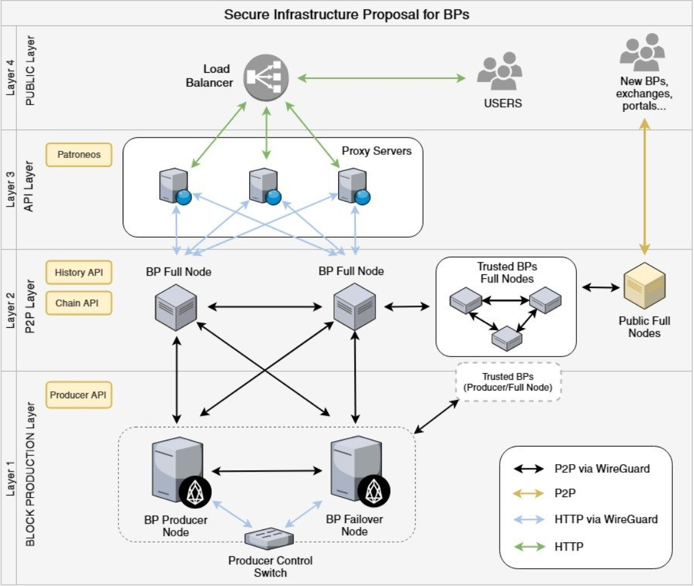

# EOS Block Producer

This is one possible proof of concept configuration of a block producer that could contribute to the EOS blockchain. It uses Docker Compose to spin up multiple Docker containers, some of which run EOSIO nodes, and others of which run proxies to serve as an extra layer of protection from basic Denial of Service attacks. By modifying the addresses in the [.env](.env) file, you could theoretically connect to other block producers in the Mainnet or even spin up twenty copies of this configuration on different hosts to create your own block producing network. Check out EOSIO's [Developer Portal](https://developers.eos.io/) if you want to learn more about the EOSIO platform and how it works.

The proxies were implemented by cloning and modifying EOSIO's [Patroneos](https://github.com/EOSIO/patroneos) repository. Unfortunately, they currently only work on a Linux host because of the way Docker works on OS X and Windows. All the containers will still run, but you will not get proper results by trying to connect to the proxies' ports. See the [Advanced Patroneos Tutorial](/patroneos/TUTORIAL-ADVANCED.md) for a more in-depth explanation.

## Requirements

* [Docker Engine](https://docs.docker.com/install/overview/)  1.13.0+
* [Docker Compose](https://docs.docker.com/compose/install/) 1.10.0+

## Quickstart

To start all the docker containers, you can simply clone the repository, and then run `docker-compose up` from within the repository directory.

```
git clone https://github.com/jaythemishra/eos-block-producer
cd eos-block-producer
docker-compose up
```

## Block Producer Configuration Diagram



As you can see in the above diagram, the four EOS nodes communicate via p2p, while the proxies and producer control switch communicate with the EOS nodes via HTTP. I did not use [WireGuard](https://www.wireguard.com/) as shown in the diagram because the network connecting the EOS nodes was contained to Docker Compose anyway.

## Testing

You can test that this configuration works by running another EOS node in a Docker container and sending requests to the proxy ports to get information about the blockchain or even to try to execute transactions.

```
docker run --rm --name eosio -d -p 8988:8888 -p 9976:9876 -v /tmp/work:/work -v /tmp/eosio/data:/mnt/dev/data -v /tmp/eosio/config:/mnt/dev/config eosio/eos-dev  /bin/bash -c "nodeos -e -p eosio --plugin eosio::producer_plugin --plugin eosio::history_plugin --plugin eosio::chain_api_plugin --plugin eosio::history_api_plugin --plugin eosio::http_plugin -d /mnt/dev/data --config-dir /mnt/dev/config --http-server-address=0.0.0.0:8888 --access-control-allow-origin=* --contracts-console --http-validate-host=false"

alias cleos='docker exec -it eosio /opt/eosio/bin/cleos -u http://{YOUR_IP_ADDRESS}:8081 --wallet-url http://0.0.0.0:8888'

cleos get info
```

You can also see the producer control switch shift block production from the Producer Node to the Failover Node as well by running the following command and paying close attention to the output of the containers in your terminal:

```
curl http://127.0.0.1:8890/v1/producer/pause
```

## Improvements

Currently, the proxy containers all use network_mode: host. This is not ideal, but I have not been able to figure out how to make them work without this yet. Also, the script behind the Producer Control Switch is currently very simple and only switches over production if both nodes have production paused. Implementing WireGuard would also probably be a good idea if these containers were to be deployed on separate hosts.
